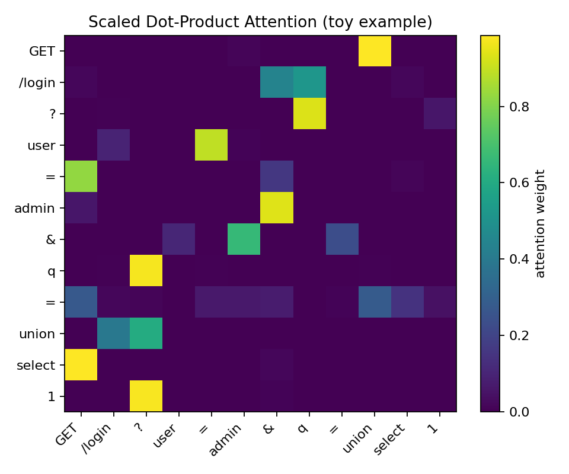
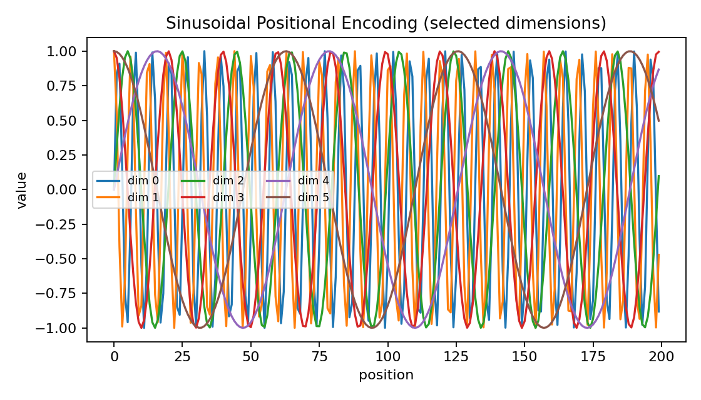

# Task 2 — Transformer Networks in Cybersecurity

**Course:** AI & ML for Cybersecurity — Final Exam Retake
**Student:** Bekar Oikashvili

---

## 1️⃣ Overview

The **Transformer** is a deep-learning architecture built entirely on **self-attention**, a mechanism that allows the model to learn which parts of an input sequence are most relevant to each token.
Instead of processing data sequentially (like RNNs or LSTMs), Transformers compute relationships between all tokens in parallel, giving them extraordinary efficiency and the ability to model long-range dependencies.

Each Transformer layer contains three main components:

1. **Multi-Head Attention (MHA)** – computes multiple attention “heads,” each capturing a different type of relationship.
2. **Feed-Forward Network (FFN)** – applies nonlinear transformations to enrich learned representations.
3. **Positional Encoding** – injects information about token order using sinusoidal or learned vectors.

Mathematically, scaled dot-product attention is:
[
\text{Attention}(Q,K,V)=\operatorname{softmax}!\left(\frac{QK^\top}{\sqrt{d_k}}\right)V
]

Because the architecture has **no recurrence or convolution**, it achieves parallelization and scalability crucial for analyzing massive cybersecurity logs or packet streams.

### Cybersecurity Applications

Transformers have rapidly become central in security analytics:

* **Phishing & Spam Detection:** Analyze email content or URLs contextually.
* **Intrusion & Log Anomaly Detection:** Model event sequences in SIEM logs to spot rare patterns.
* **Malware Classification:** Encode byte sequences or API call chains to learn behavioral signatures.
* **Threat Intelligence:** Extract entities from reports and link related IOCs.
* **Web Attack Detection:** Detect SQL injection or XSS payloads by contextual understanding of requests.

Attention allows the model to focus on tokens such as suspicious domains or keywords, while positional encodings let it understand temporal ordering of events—vital in network flows or log streams.
By fine-tuning pre-trained encoders (e.g., BERT, DistilBERT, DeBERTa) on domain-specific data, practitioners achieve state-of-the-art accuracy with limited labels, greatly enhancing cyber-defense automation.

---

## 2️⃣ Visualization of the Attention Mechanism

The figure below shows a toy **scaled dot-product attention** map for an HTTP request sequence.
Rows = query tokens; columns = key tokens; brighter cells = stronger attention.



> Example interpretation: the model focuses on suspicious tokens like “union” and “select” when processing the query, mirroring how a cybersecurity transformer detects malicious payload patterns within requests.

---

## 3️⃣ Visualization of Positional Encoding

Transformers lack intrinsic sequence order, so they add **sinusoidal positional encodings** to the input embeddings.
Each dimension oscillates with a different frequency, enabling the model to infer both absolute and relative positions.



> Distinct frequencies act as a basis allowing the network to compute relative distances linearly—critical for tracking event order in logs or packets.

---

## 4️⃣ Scripts for Figure Generation

Both plots can be regenerated from the repository’s `scripts/` folder:

```bash
# Attention heatmap
python3 scripts/make_attention.py
# Positional encoding curves
python3 scripts/make_posenc.py
```

The outputs (`figs/attention_demo.png`, `figs/positional_encoding.png`) are used in this report.

---

## 5️⃣ Practical Usage Tips for Cybersecurity

* **Tokenization:** Split logs/requests by special characters (`/`, `=`, `?`, `&`, `.`) and apply BPE or WordPiece.
* **Pretraining:** Use masked-language modeling on millions of logs for self-supervised learning.
* **Explainability:** Visualize attention maps to justify alerts (e.g., model attended “union select”).
* **Efficiency:** Deploy distilled models for real-time NIDS/SIEM pipelines.

---

✅ **Files included**

```
task2.md
scripts/make_attention.py
scripts/make_posenc.py
figs/attention_demo.png
figs/positional_encoding.png
```

