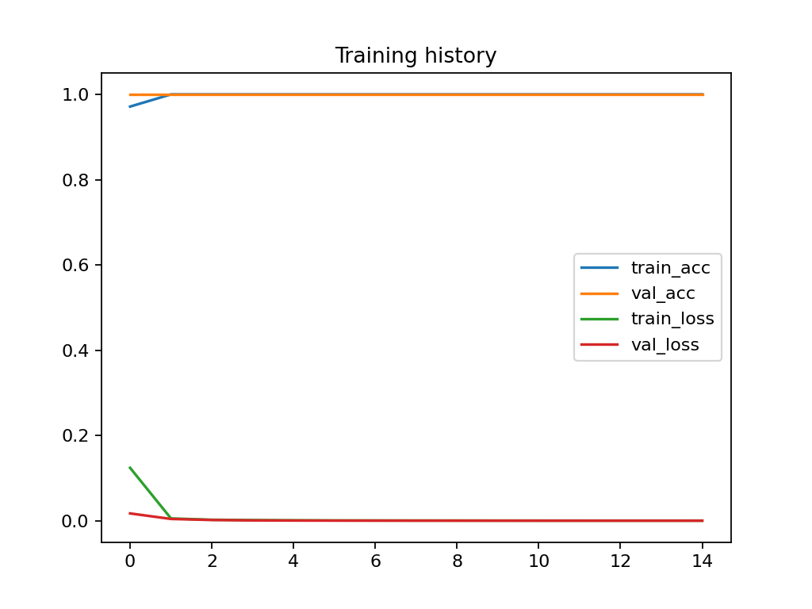
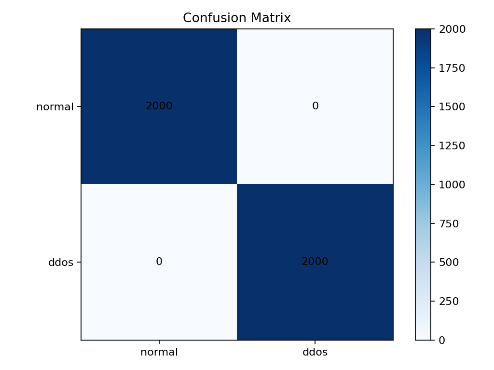

#  Task 3 — DDoS Attack Detection with a 1D CNN

**Course:** AI & ML for Cybersecurity
**Student:** Bekar Oikashvili

---

## 🔗 Project Map

* Data generator: [`generate_ddos_data.py`](./generate_ddos_data.py)
* Trainer: [`train_cnn_ddos.py`](./train_cnn_ddos.py)
* Evaluator: [`evaluate.py`](./evaluate.py)
* Single-sample predictor: [`predict.py`](./predict.py)
* Figures (auto-created): [`figs/history_acc_loss.png`](./figs/history_acc_loss.png), [`figs/confusion_matrix.png`](./figs/confusion_matrix.png)
* Trained model (auto-created): [`models/cnn_ddos.keras`](./models/cnn_ddos.keras)

---

## 🚀 Quickstart

```bash
cd task_3
python3 -m venv .venv && source .venv/bin/activate
pip install -r requirements.txt
```

### 1) Generate dataset

```bash
python ./generate_ddos_data.py --out ./data/ddos_windows.npz --n-normal 2000 --n-ddos 2000 --seed 42
```

* Output: `./data/ddos_windows.npz` (shapes like `X=(4000, 60, 8)`, `y=(4000,)`)

### 2) Train the CNN

```bash
python ./train_cnn_ddos.py --data ./data/ddos_windows.npz --epochs 15 --batch 64 --model ./models/cnn_ddos.keras
```

* Output:

  * Model → [`./models/cnn_ddos.keras`](./models/cnn_ddos.keras)
  * Training curves → [`./figs/history_acc_loss.png`](./figs/history_acc_loss.png)

### 3) Evaluate

```bash
python ./evaluate.py --data ./data/ddos_windows.npz --model ./models/cnn_ddos.keras
```

* Output: metrics printed + confusion matrix → [`./figs/confusion_matrix.png`](./figs/confusion_matrix.png)

### 4) Predict a sample

```bash
python ./predict.py --model ./models/cnn_ddos.keras --data ./data/ddos_windows.npz
```

---

## 👁️ Visualizations (actual files)

**Training history**


**Confusion matrix**


> If these images don’t render on GitHub, confirm they exist at the exact paths above after running the scripts.

---

## 📦 Data Representation (what the model sees)

Each sample is a **60×8** time window:

1. `pkts_in`, 2. `pkts_out`, 3. `bytes_in`, 4. `bytes_out`,
2. `uniq_src_ips`, 6. `uniq_dst_ports`, 7. `syn_rate`, 8. `rst_rate`.

* Normal windows: moderate, noisy fluctuations
* DDoS windows: sustained spikes in inbound volume, unique sources, and SYN rate

---

## 🧠 Model (why a 1D CNN)

```
Input (60×8)
 → Conv1D(32,k=5) + BN + ReLU + MaxPool
 → Conv1D(64,k=3) + BN + ReLU + GlobalAvgPool
 → Dense(64) + Dropout(0.25)
 → Dense(1, sigmoid)
```

1D convolutions learn **temporal motifs** (e.g., SYN floods, fan-out surges); pooling adds shift-invariance.

---

## 🧪 Example Results (from this repo’s run)

```
Accuracy: 1.0000, ROC-AUC: 1.0000
Confusion Matrix:
[[2000    0]
 [   0 2000]]
```

These perfect metrics reflect the clean separation in the synthetic generator. For more realistic scores, lower the class separation or add noise (see notes below).

---

## ✍️ Reproduce or Tweak (visible code entry points)

* **Generator knobs** → edit in [`generate_ddos_data.py`](./generate_ddos_data.py):

  * reduce attack shift / add benign bursts / optional label noise
* **Training controls** → flags in [`train_cnn_ddos.py`](./train_cnn_ddos.py): `--epochs`, `--batch`
* **Evaluation output** → figure saved by [`evaluate.py`](./evaluate.py) to `./figs/confusion_matrix.png`

---

## 🔧 Make it less “perfect” (optional)

Open [`generate_ddos_data.py`](./generate_ddos_data.py) and:

* reduce DDoS amplification in `synth_window_ddos`
* add short benign bursts in `synth_window_normal`
* (optional) flip ~2–3% labels after `y` is created

Then re-run the three commands (generate → train → evaluate). Figures update automatically.

---

## 📝 Requirements

See [`requirements.txt`](./requirements.txt):

```
numpy
pandas
scikit-learn
tensorflow
matplotlib
```
